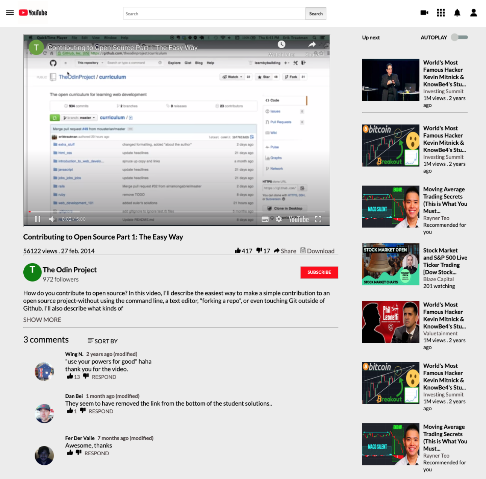

# YouTube Video Player Clone Page

> Embedding images and videos

This project is to demonstrate our understanding of working with media by building YouTube’s Video Player Page.

The goal of the project was to focus on making media elements show up. Ability to let the video play as well as showing the little thumbnail images on the right side bar of the page.

## Built With

-   HTML,
-   CSS

## Live Demo

[Live Demo Link](https://acushlakoncept.github.io/youtube-player-page/)

## Authors

👤 **Uduak Essien**

-   Github: [@githubhandle](https://github.com/acushlakoncept/)
-   Twitter: [@twitterhandle](https://twitter.com/acushlakoncept)
-   Linkedin: [linkedin](https://www.linkedin.com/in/acushlakoncept/)

👤 **Emmanuelle Kamwa**

-   Github: [@githubhandle](https://github.com/emmanuellekamwa)
-   Twitter: [@twitterhandle](https://twitter.com/AlixKamwa)
-   Linkedin: [linkedin](https://www.linkedin.com/in/emmanuelle-kamwa-86145a1a4/)
